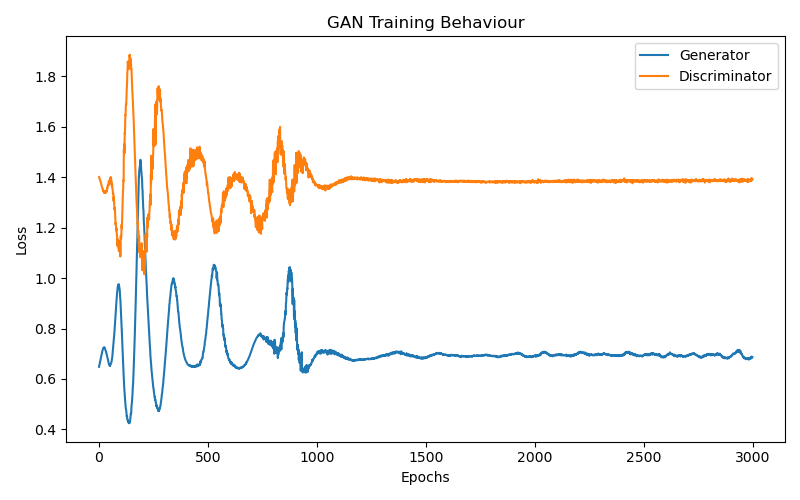
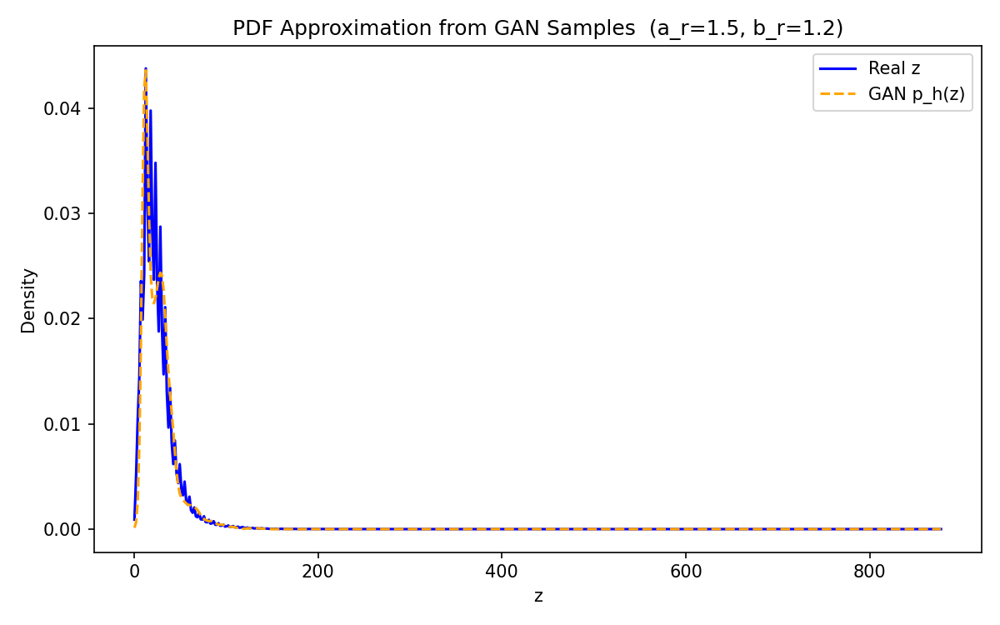
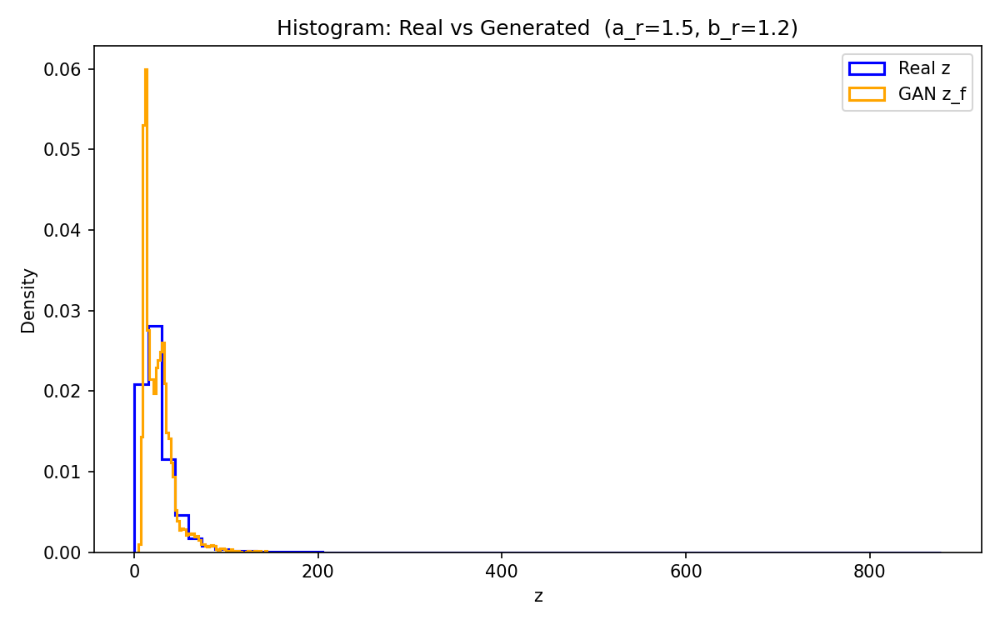

# PDF Estimation using GAN

**Roll Number:** 102303078

## Dataset

India Air Quality dataset from Kaggle. Used the `no2` column as x. Dropped NaN and zero values.

Link: https://www.kaggle.com/datasets/shrutibhargava94/india-air-quality-data

## Transformation

r = 102303078

a_r = 0.5 * (r mod 7) = 1.5

b_r = 0.3 * (r mod 5 + 1) = 1.2

z = x + 1.5 * sin(1.2 * x)

## GAN Architecture

Generator:
- Linear(1 → 64), LeakyReLU(0.2)
- Linear(64 → 64), LeakyReLU(0.2)
- Linear(64 → 1)

Discriminator:
- Linear(1 → 64), LeakyReLU(0.2)
- Linear(64 → 64), LeakyReLU(0.2)
- Linear(64 → 1), Sigmoid

Loss: BCELoss
Optimizer: Adam (lr=0.0003)
Epochs: 3000, Batch size: 256

## Training

z is normalized before training and denormalized after. Discriminator is updated first, then generator. No parametric distribution was assumed.

## Results







## Observations

**Mode coverage:** The generated mean is very close to the real mean so the GAN is capturing the main peak of the distribution.

**Training stability:** Both losses settle near 0.693 (log 2) which means the discriminator can't tell real from fake — that's the expected equilibrium.

**Quality:** The spread of generated samples is close to the real std. The KDE curves overlap well on the plot.

## How to run

```bash
pip install numpy pandas torch matplotlib scipy
python main.py
```
